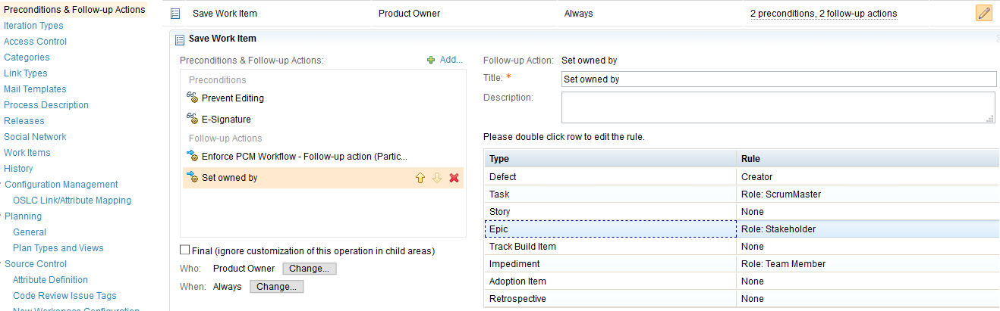
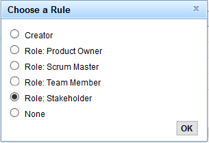

[![travis-svg][travis-svg]][travis]

# Set Owned by Editor UI

This widgets provides a UI to configure the [rtc-set-owned-by-participant](https://github.com/jazz-community/rtc-set-owned-by-participant) in the Web UI. This will not work for the eclipse Client.

## Configuration

After you installed this and the [rtc-set-owned-by-participant](https://github.com/jazz-community/rtc-set-owned-by-participant) this table will show up if the participant is added to a Project Area. Any previously made changes in the process source are reflected in the table and not lost.
However it is recommended that the process source is not edited directly anymore, after this has been installed.

 To change the Rule for a Work Item Type just double click the row. A small window will pop up, where a rule can be selected. To delete a rule just do the same and select "none"

## Setup

### Download
You can find the latest release on the [releases page of this repository](../../realeases).

### Installation
Deploy just like any other update site:

1. Extract the `com.siemens.bt.jazz.viewlet.setOwnerUi_updatesite.ini` **file** from the zip file to the `server/conf/ccm/provision_profiles` directory
2. Extract the `com.siemens.bt.jazz.viewlet.setOwnerUi_updatesite` **folder** to the `server/conf/ccm/sites` directory
3. Restart the server

### Updating an existing installation
1. Request a server reset in **one** of the following ways:
    * If the server is currently running, call `https://server-address/ccm/admin/cmd/requestReset`
    * Navigate to `https://server-address/ccm/admin?internaltools=true` so you can see the internal tools (on the left in the side-pane).
     Click on `Server Reset` and press the `Request Server Reset` button
    * If your server is down, you can delete the ccm `built-on.txt` file.
     Liberty packed with 6.0.3 puts this file in a subfolder of `server/liberty/servers/clm/workarea/org.eclipse.osgi/**/ccm`. The easiest way to locate the file is by using your operating system's search capabilities.
2. Delete previously deployed updatesite folder
3. Follow the file extraction steps from the section above
4. Restart the server

## Contributing
Please use the [Issue Tracker](../../issues) of this repository to report issues or suggest enhancements.

For general contribution guidelines, please refer to [CONTRIBUTING.md](https://github.com/jazz-community/welcome/blob/master/CONTRIBUTING.md)

## Licensing
Copyright (c) Siemens AG. All rights reserved. 
Licensed under the [MIT](./LICENSE) License.

[travis-svg]: https://travis-ci.org/jazz-community/rtc-set-owned-by-participant-editor.svg?branch=master
[travis]: https://travis-ci.org/jazz-community/rtc-set-owned-by-participant-editor
